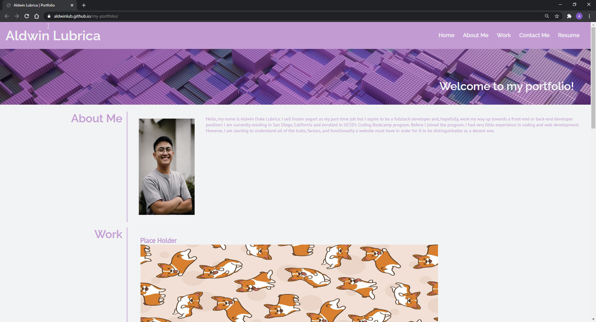
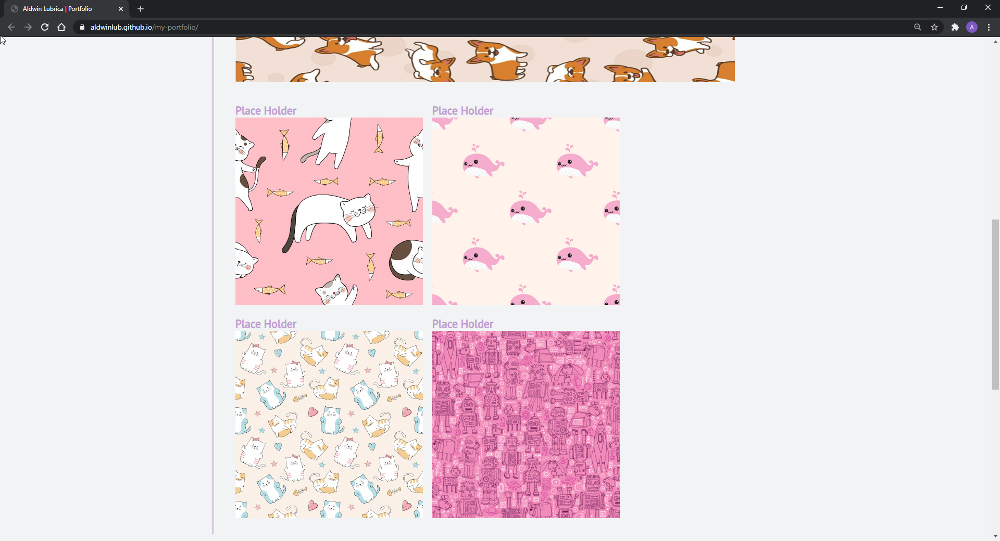
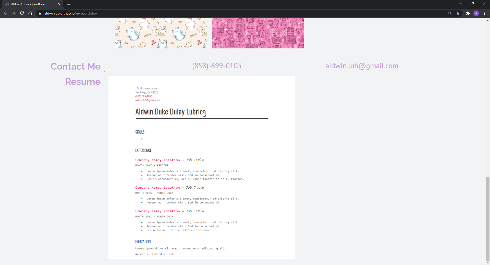

# my-portfolio

## An Overview Of What I Managed To Do

This week, we were assigned to create our own portfolios. I managed to make one from scratch and was able to create a header section with working links, an "About Me" section, a "Work" section with grids, a "Contact Me" section, and a "Resume" section.

# Link to my Git Hub Pages

https://aldwinlub.github.io/my-portfolio/

# Screenshots!

Here is a snippet of my portfolio.

