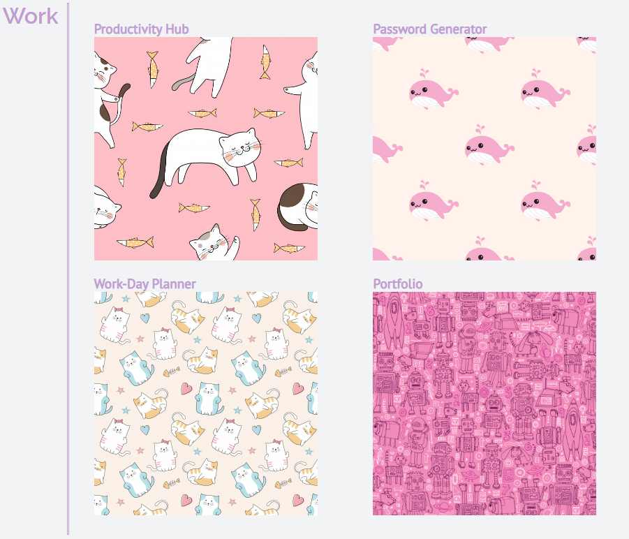
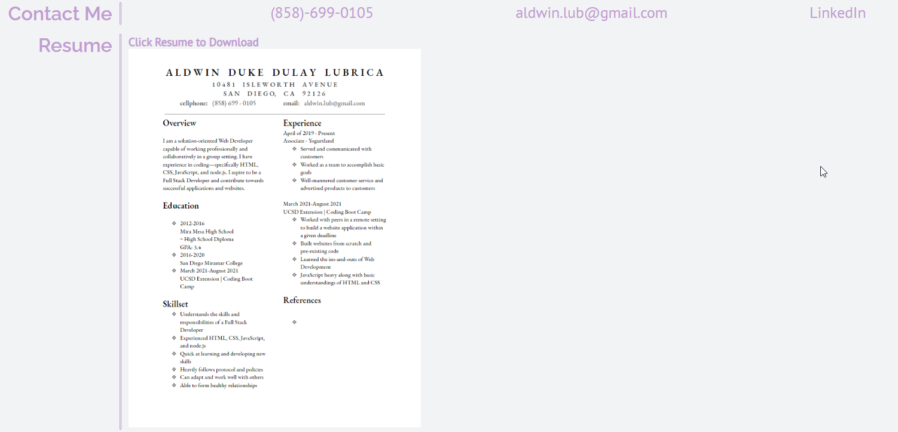

# my-portfolio

## An Overview Of What I Managed To Do

This week, we were assigned to create our own portfolios. I managed to make one from scratch and was able to create a header section with working links, an "About Me" section, a "Work" section with grids, a "Contact Me" section, and a "Resume" section.

### Update!

I updated the "Work" area and added working links that leads the user of some of the assignments and projects that I worked on. I included the Productivity Hub project where I worked in a group while I also added links to the Work-Day Planner and the Password Generator assingments that I completed. I added a link to the portfolio jst to make it look a bit nicer.

I also included a link to my LinkedIn in the "Contact Me" section and an updated and downloadable PDF of my resume located in the "Resume" section.

# Link to my Git Hub Pages

https://aldwinlub.github.io/my-portfolio/

# Screenshots!

## Here is a snippet of my portfolio.

### Updated Screenshots!

